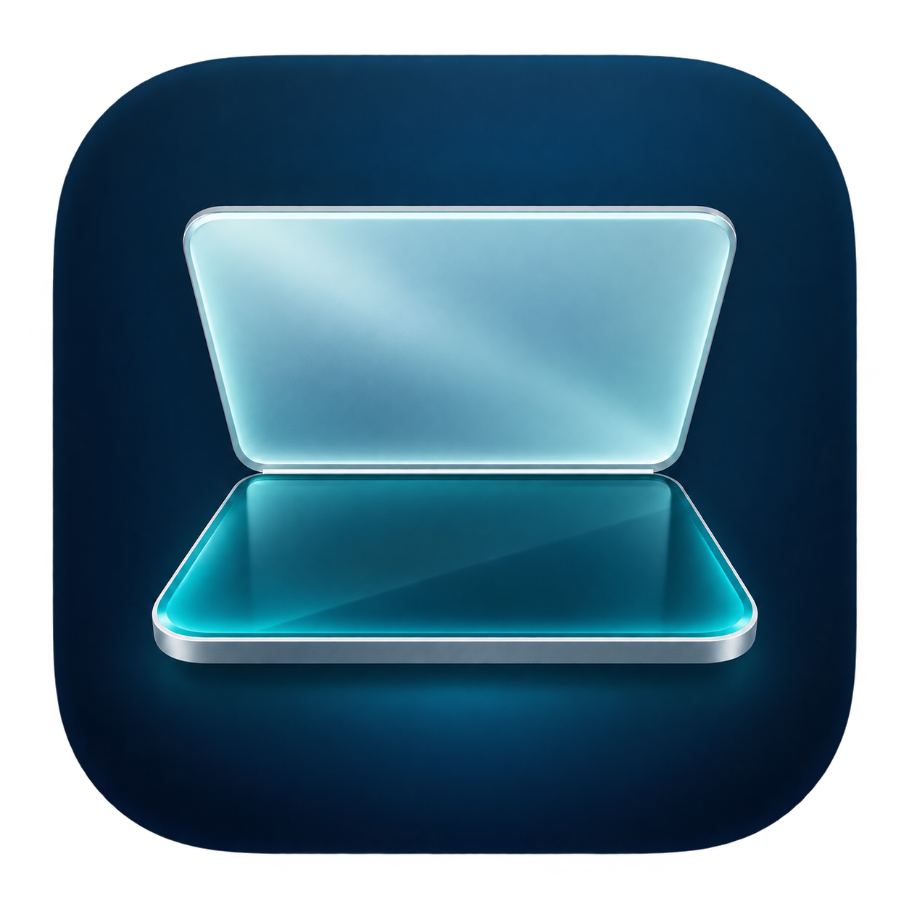
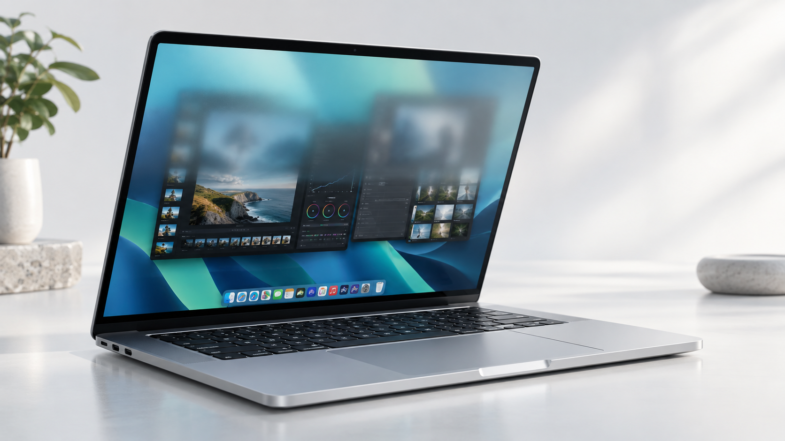
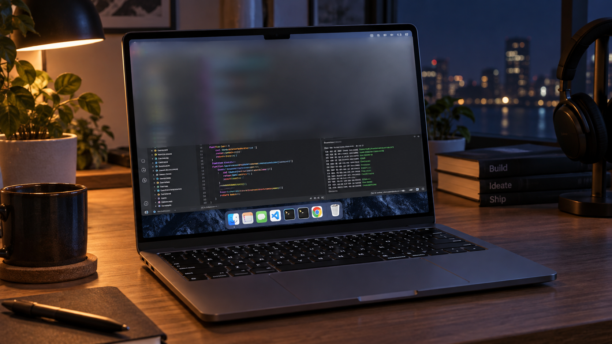
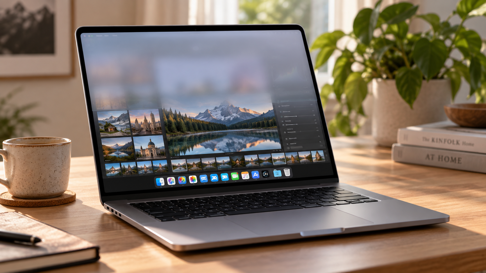

<p align="center"></p>
<h1 align="center">MacDuo</h1>
<p align="center">A little motion. A different feeling.<br>随手合盖，让桌面覆上一层玻璃。</p>
<p align="center"><a href="README.en.md">English</a> · <a href="https://github.com/andyhuo520/MacDuo/releases">下载 / Downloads</a> · <a href="LICENSE">MIT License</a></p>



MacDuo 是一个原生 macOS 菜单栏应用。缓慢合上 MacBook 屏幕时，桌面上的毛玻璃覆盖范围随角度向下延伸；重新展开时逐渐恢复清晰。普通模式下移动鼠标或操作键盘会交还真实桌面；启用保持模糊后需要确认恢复。

> 上图及下方场景图均为 AI 生成的效果示意，并非应用实拍。屏幕硬件不会弯曲，软件也不会把页面翻折；实际效果是原位桌面快照上的渐进毛玻璃。

## 新增：注视模式（1.1.0 实验版）

在控制窗口选择「注视模式 · 使用摄像头」，点击开始并选择内置屏幕，然后允许摄像头访问。先正对屏幕约半秒完成就绪：可设置离开 1 秒至 5 分钟后触发。玻璃每次从随机一侧缓慢扩散；默认保持模糊，回来后显示恢复提示。关闭“保持模糊”则回看自动退去，鼠标或按键可临时恢复。

这是**人脸朝向估计，不是精确视线追踪**：只移动眼球可能无法识别，暗光、眼镜、角度和多人入镜也可能影响结果。不是隐私保护或安全锁屏功能。摄像头中断时会撤下模糊层并停止模式。

只在注视模式运行时使用内置摄像头，640×480 采集、约 5 Hz 本地 Vision 分析；不保存或上传画面、不做人脸身份识别、不使用麦克风。暂停、切回合盖模式、锁屏和退出会停止摄像头。为了能发现用户回看，注视模式启用期间保持摄像头检测，**不采用合盖模式的 90 秒待机规则**。

## 特性

- **跟随开合角度**：合盖约 3° 触发一次桌面截图，雾化范围和强度随角度变化，未覆盖部分保持清晰。
- **柔和玻璃材质**：两级模糊、轻微折射与通透感，没有扫描光带。
- **不挡操作**：合盖及非保持模式鼠标穿透、输入即撤下快照；保持模式接收输入，等待确认恢复。
- **菜单栏控制**：暂停、恢复、查看状态和退出，没有常驻桌面浮条。
- **自动待机**：90 秒没有明显角度变化，释放效果窗口和纹理；保留低频检测，再次合盖唤醒。
- **休眠恢复**：锁屏期间暂停，解锁后尝试恢复；若系统共享选择失效，需要重新选屏。
- **可选开盖音效**：支持自己的 WAV 录音，默认关闭。公开版不附带音频。

## 安装与开始

要求 **macOS 15.2+、Apple Silicon MacBook，以及可读取的开盖角度传感器**。已在 MacBook Pro18,3（M1 Pro，macOS 26）开发机上使用；其他机型尚未逐一验证。Intel Mac、外接屏幕和没有角度传感器的设备不在支持范围内。

1. 从 [Releases](https://github.com/andyhuo520/MacDuo/releases) 下载 Apple Silicon DMG，将 MacDuo 拖到 Applications。
2. 打开 MacDuo，点击「选择屏幕并开始」，在 macOS 选择器中选择内置屏幕。
3. 缓慢合盖，观察磨砂范围变化；展开恢复。移动鼠标或按键也会立即结束当前画面。
4. 关闭控制窗口后，通过菜单栏电脑图标继续控制。暂停只停止监听，退出则关闭应用。

目前发布包为**开发签名、未公证试用版**，macOS 可能阻止打开；可自行审阅源码并构建。应用不会在锁屏或登录界面显示效果。

### 可选音效

将你有权使用的 WAV 文件放到 `~/Library/Application Support/MacDuo/HingeCreak.wav`，重新启动应用，然后在菜单栏开启「开盖音效」。建议使用约 2 秒、音量适中的录音。源码构建也可将文件放入 `Resources/HingeCreak.wav`；该路径已被 Git 忽略。

## 场景

### 夜间编程



### 摄影工作台



以上均为 AI 概念图。实际效果根据桌面内容和合盖角度变化，当前版本不会持续刷新快照内的视频或应用内容。

## 从源码构建

安装提供 macOS 15.2 或更新 SDK 的 Xcode / Command Line Tools，并确保 `xcrun swiftc` 可用：

```sh
git clone https://github.com/andyhuo520/MacDuo.git
cd MacDuo
zsh build.sh
```

生成 `MacDuo.app`。默认使用临时签名，供本地构建；要使用自己的开发签名：

```sh
DUOFOLD_SIGNING_IDENTITY="Apple Development: Your Name (TEAMID)" zsh build.sh
```

不要修改正在运行的应用。保持安装路径、Bundle ID 和签名身份稳定，可以减少更新后的授权问题。安装本地构建前先退出已有 MacDuo。

### 测试

```sh
zsh scripts/test.sh
```

覆盖连续开合、输入接管、待机、菜单、休眠恢复状态机、音效触发以及 Metal 像素回归。测试不会锁屏或捕获桌面，但部分测试会短暂启动真实传感器子进程；需要支持 Metal 的 Mac。自动测试不能替代实际合盖、选屏授权和唤醒验证。

## 实现与隐私

Swift + AppKit 管理应用与菜单；IOKit 读取角度，ScreenCaptureKit 单次捕获桌面，Core Image 准备两级模糊纹理，Metal 根据角度绘制原位覆盖层。传感器和看门狗位于独立子进程。

每次触发仅捕获一张本地快照，合盖模式不使用摄像头；注视模式仅在启用时使用摄像头。不使用麦克风、不联网、不保存桌面截图。输入检测只比较系统事件计数，不读取按键内容。状态日志保存在 `~/Library/Logs/DuoFoldDesktop/lifecycle.log`，包含生命周期、角度与错误信息。看门狗可结束失去响应的应用，但不能保证恢复系统级 GPU 或内核故障。

详见 [架构说明](docs/ARCHITECTURE.md) 与 [贡献指南](CONTRIBUTING.md)。

## 作者与致谢

Berryxia · [X](https://x.com/Berryxia) · [andyhuo@me.com](mailto:andyhuo@me.com)

灵感来源：duo.grok.me。角度拟合及部分早期几何实现参考 [Bendable](https://github.com/opensourcevillain/Bendable)，保留其 MIT 许可。MacDuo 为独立项目，与 Apple 无关联。

[MIT License](LICENSE) · [第三方及素材说明](THIRD_PARTY_NOTICES.md)


## 1.2.0：离开计时与液态扩散

- 离开时间：1、3、5、10、30 秒，或 1、2、5 分钟。设置会保存。
- 每次触发随机从左、右、上、下开始，约 1.6 秒柔和扩散，带轻微折射与起伏边缘，没有扫光线，不需选择方向。
- 默认保持模糊，移动鼠标、回看都不自动撤销。回来后卡片显示“欢迎回来”，点击恢复。
- 可选 Touch ID／系统密码验证后恢复，通过 macOS LocalAuthentication 完成；应用不接触密码。取消验证则保持遮罩。
- 模糊画面显示离开时长和一条可填写的待办提醒，设置仅保存在本机。
- 暂停、退出和锁屏清理遮罩与计时；菜单栏始终可用。它是视觉休息遮罩，不是安全锁屏，退出应用或暂停仍可撤销效果。

取消“模糊后保持”可保留回看自动恢复的交互。保持期间遮罩接收点击与普通按键，Escape 请求恢复；通过菜单栏也可恢复或暂停。身份验证需要用户在实机完成，自动化测试不代替该项验收。
